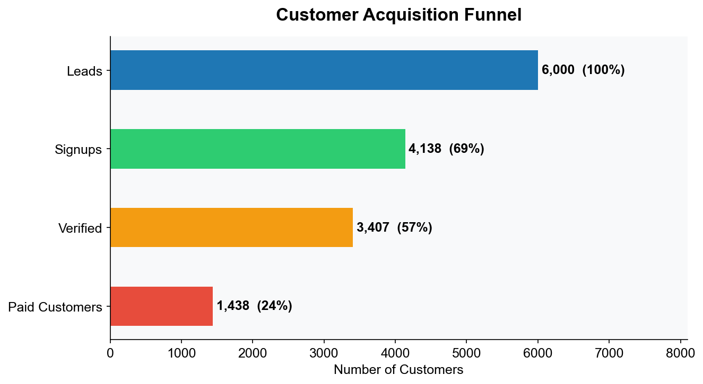
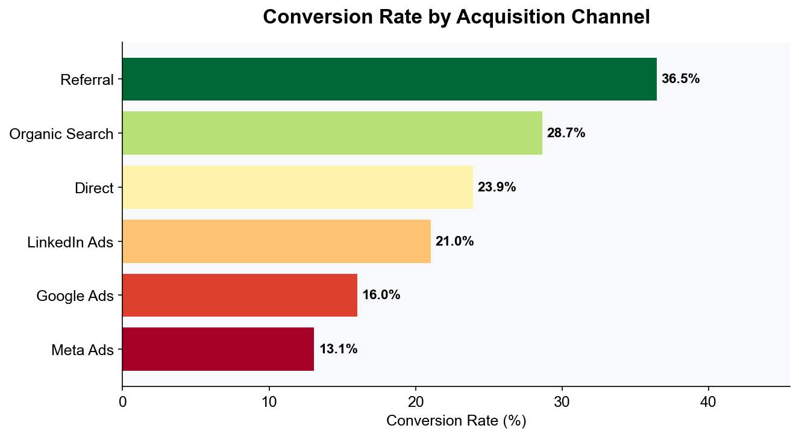
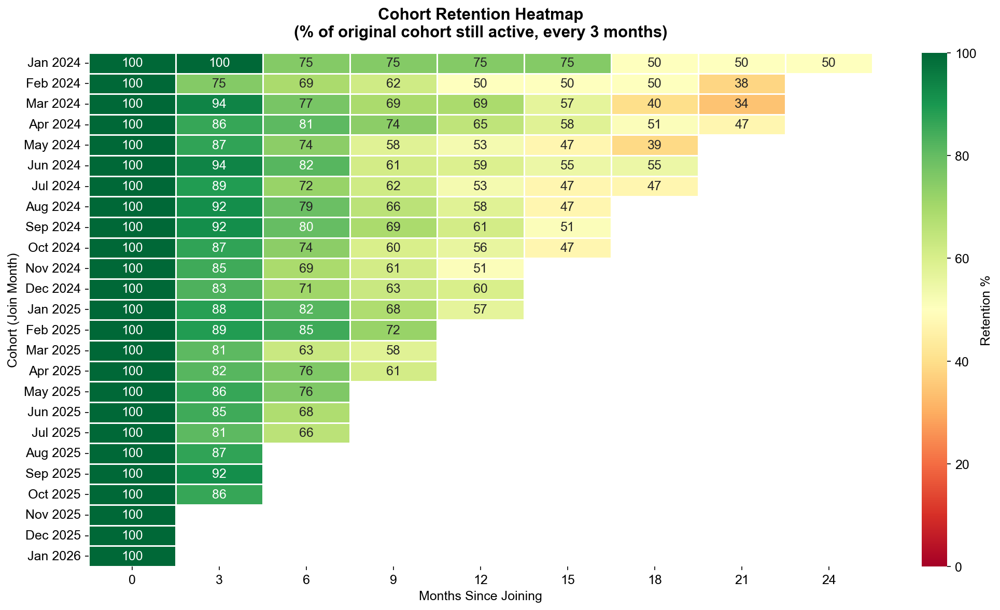
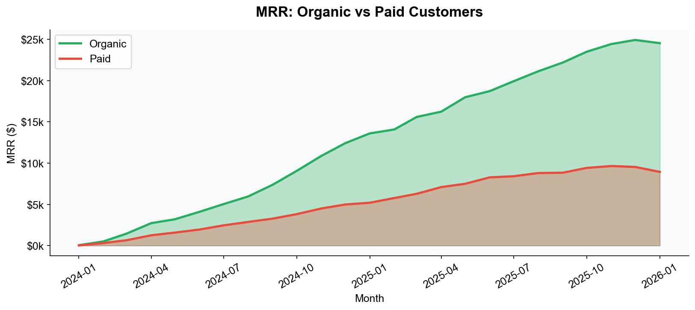

# Customer Churn & Retention Analysis

> **SaaS business analysis** uncovering why paid acquisition converts at half the rate of organic — with cohort retention heatmap, funnel analysis, and MRR tracking.

---

## Acquisition Funnel



6,000 leads → 1,438 paid customers — **only 24% make it all the way through.**

---

## Conversion Rate by Channel



Referral (36.5%) converts **2.8× better** than Meta Ads (13.1%). Paid channels are the weakest performers.

---

## Cohort Retention Heatmap



Each row = a monthly cohort. Green = high retention. Early cohorts retain 50%+ after 24 months.

---

## MRR: Organic vs Paid



Organic drives **$25k MRR** vs Paid's **$9k** — despite similar lead volume. Paid acquisition is expensive and underperforms.

---

## Key Business Findings

1. **Paid channels convert at half the rate of organic** — Meta Ads (13.1%) vs Referral (36.5%)
2. **Organic dominates revenue** — 75%+ of MRR comes from organic channels despite similar lead volume
3. **Jan 2025+ cohorts retain better** — early onboarding improvements showing results
4. **India leads volume** (615 paid customers), US (315), UK (181)

## Recommendations

1. **Cut Meta Ads spend** — 13.1% CVR is below break-even for most SaaS CAC models
2. **Invest in Referral program** — highest CVR at 36.5% with low acquisition cost
3. **Investigate 2024 cohort drop-off** — faster Month 12+ decay vs 2025 cohorts
4. **Double down on organic SEO/content** — drives 75% of MRR at 30% CVR

---

## Files

| File | Description |
|------|-------------|
| `Customer_Churn_Analysis.ipynb` | Full analysis notebook with all 7 interactive charts |
| `Churn_Analysis_Dashboard.html` | Standalone interactive dashboard (open in browser) |
| `customers.csv` | 6,000 customer records with acquisition journey |
| `subscriptions_monthly.csv` | Monthly subscription & MRR data |

## Tech Stack

**Python** (pandas, numpy) · **Plotly** (Funnel, Heatmap, Area, Line, Bar) · **Jupyter Notebook**

## How to Run

```bash
git clone https://github.com/darshitjayswal1/saas-churn-acquisition-analysis
cd saas-churn-acquisition-analysis
jupyter notebook Customer_Churn_Analysis.ipynb
```

Or open `Churn_Analysis_Dashboard.html` directly in any browser for the interactive dashboard.

---
*Dataset: Proprietary SaaS customer acquisition data (Jan 2024 – Jan 2026)*
